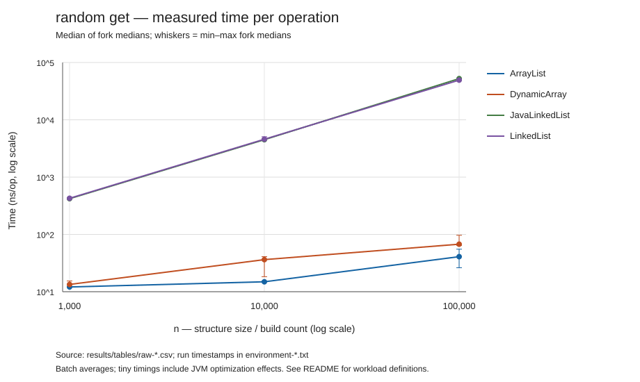
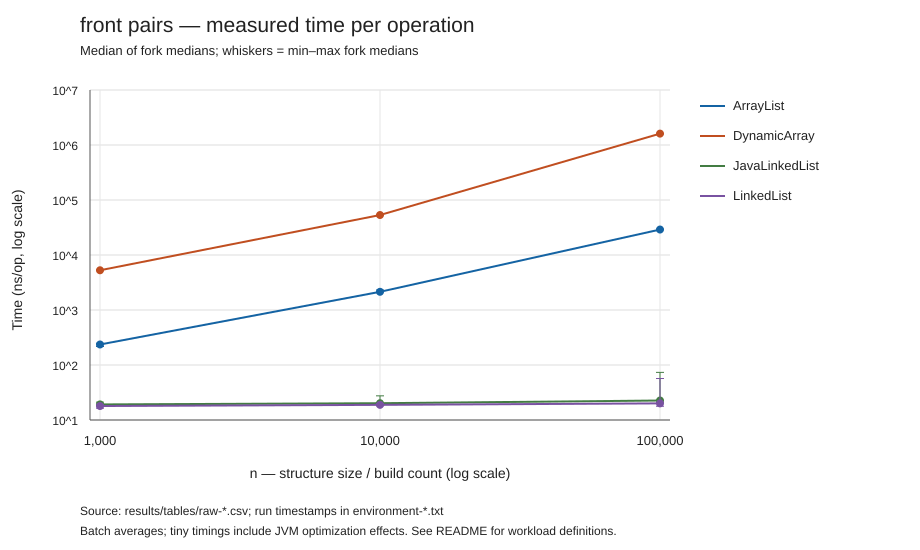
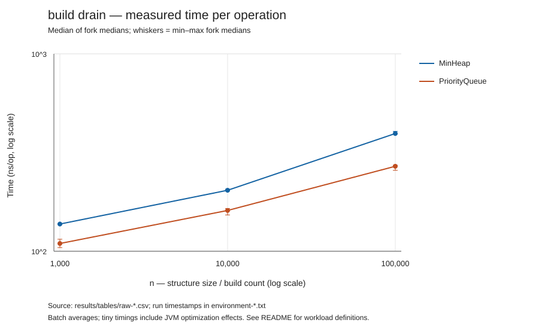

# Assignment 2 — Algorithmic Analysis, Correctness and Performance Trade-offs

## 1. Overview

This Java 17 project implements a generic dynamic array, doubly linked list, and binary min-heap. It combines asymptotic analysis, two loop-invariant proofs, differential correctness tests, and a reproducible experiment against Java's standard collections.

The dynamic array doubles its backing storage, the linked list stores head and tail pointers and traverses from the nearer end, and the heap stores its complete binary tree in a dynamic array. Both lists implement `add(x)`, `add(index, x)`, `remove(index)`, `get(index)`, and `contains(x)`. The heap implements `insert(x)`, `peekMin()`, and `extractMin()`; extraction is included because the assignment explicitly requires testing it.

Where the supplied brief does not prescribe an implementation, workload, or sample size, this report documents the selected design. All submitted measurements are actual local runs, not estimated timings.

```text
src/
  IndexedList.java     Shared list contract
  DynamicArray.java    Doubling array
  LinkedList.java      Doubly linked list
  MinHeap.java         Binary min-heap
  Tests.java           Always-enabled correctness checks
  Benchmark.java       Seeded, batch-based timing harness
  Report.java          CSV aggregation, Markdown tables, SVG plots
results/
  tables/             Raw measurements, summaries, environment records
  plots/              One SVG plot per workload
run.ps1                Compile, test, and optionally benchmark
.github/workflows/     Compile and test on pushes and pull requests
```

### Run locally

Only a JDK 17 or newer is required. There are no external libraries or build-system dependencies. From the repository root on Windows:

```powershell
# Compile with all javac warnings enabled and run correctness tests.
powershell -NoProfile -ExecutionPolicy Bypass -File ./run.ps1

# Also run three independent JVM forks and regenerate tables and plots.
powershell -NoProfile -ExecutionPolicy Bypass -File ./run.ps1 -Benchmark
```

The execution-policy option applies only to the launched PowerShell process. A portable alternative, from a shell that expands file globs:

```sh
mkdir -p out
javac -encoding UTF-8 -Xlint:all -d out src/*.java
java -cp out Tests
java -Xms256m -Xmx256m -cp out Benchmark results/tables/raw-1.csv 1
java -Xms256m -Xmx256m -cp out Benchmark results/tables/raw-2.csv 2
java -Xms256m -Xmx256m -cp out Benchmark results/tables/raw-3.csv 3
java -cp out Report results/tables/raw-1.csv results/tables/raw-2.csv results/tables/raw-3.csv
```

Benchmark commands overwrite the corresponding result files. `Report` aggregates exactly the input files passed to it. Changing the number of forks with `-Forks` changes the sample count. If rerunning the experiment, also update the selected results and discussion below from the new summary.

## 2. Complexity Analysis

Let `n` be the number of elements immediately before an operation. Assume constant-time reference assignment, equality, comparison, and node allocation. With expensive user-defined `equals` or `compareTo`, include their cost. Bounds describe successful operations; invalid indices and empty-heap errors are detected in constant time. Logs are base two, and logarithmic bounds below apply asymptotically for `n >= 2`.

`O` gives an upper bound, `Ω` a lower bound, and `Θ` matching upper and lower bounds on the **same cost function**. The universal lower bounds below are attainable best cases; the tight worst-case column describes the maximum cost over valid inputs of size `n`. These are not interchangeable with average or amortized bounds.

| Structure | Operation | Universal lower bound | Worst-case upper bound | Tight worst case | Amortized / position detail |
|---|---|---|---|---|---|
| Dynamic array | `add(x)` | Ω(1) | O(n) | Θ(n) | Θ(1) amortized across appends |
| Dynamic array | `add(i,x)` | Ω(1) | O(n) | Θ(n) | Θ(n−i+1) without growth; Θ(n) with growth |
| Dynamic array | `remove(i)` | Ω(1) | O(n) | Θ(n) | Θ(n−i); no shrinking |
| Dynamic array | `get(i)` | Ω(1) | O(1) | Θ(1) | Direct indexing |
| Dynamic array | `contains(x)` | Ω(1) | O(n) | Θ(n) | Θ(n) for a miss or last-position match |
| Linked list | `add(x)` | Ω(1) | O(1) | Θ(1) | Tail pointer |
| Linked list | `add(i,x)` | Ω(1) | O(n) | Θ(n) | Θ(1) at either end; middle traversal dominates |
| Linked list | `remove(i)` | Ω(1) | O(n) | Θ(n) | Θ(1+min(i,n−1−i)) |
| Linked list | `get(i)` | Ω(1) | O(n) | Θ(n) | Θ(1+min(i,n−1−i)) |
| Linked list | `contains(x)` | Ω(1) | O(n) | Θ(n) | Sequential search from head |
| Min-heap | `insert(x)` | Ω(1) | O(n) | Θ(n) | O(log n) amortized; growth can copy Θ(n) references |
| Min-heap | `peekMin()` | Ω(1) | O(1) | Θ(1) | Read root |
| Min-heap | `extractMin()` | Ω(1) | O(log n) | Θ(log n) | No shrinking; early stop can take Θ(1) |

All listed Ω(1) lower bounds have Θ(1) best cases. Linked-list insertion at `i < n` costs Θ(1+min(i,n−1−i)); insertion at `i=n` bypasses traversal. A linked list does **not** provide constant-time arbitrary indexed insertion: relinking is constant-time only after finding the position.

For the dynamic array, backing-array copies during `N` appends have lengths `8,16,32,...`. Their sum is less than `2N`, so the `N` writes plus all copies cost Θ(N): amortized Θ(1) per append. This argument does not make a single growing append constant-time and does not eliminate shifting for insertion at the front.

A heap has height Θ(log n). Insertion follows at most one ancestor path; extraction follows at most one child path. With spare capacity, a worst-case insertion is Θ(log n), while an insertion that grows the array is Θ(n). Total growth cost is linear across a sequence of insertions, leaving O(log n) amortized insertion. Repeated insertion followed by complete extraction costs Θ(n log n) in the worst case. This implementation does not provide bottom-up heap construction, which could build a heap in Θ(n).

**Space:** the linked list retains Θ(n) nodes, each storing two links and one value reference. The array and heap retain Θ(max(1,Npeak)) backing slots because they never shrink, where `Npeak` is historical maximum size; they are not necessarily Θ(current n) after removals. Both use O(1) auxiliary space per ordinary operation; a resizing operation needs Θ(n) additional temporary storage. Array removal clears the vacated reference. Payload objects and JVM-specific object headers are additional costs; this experiment does not measure memory consumption.

For comparison, Java documents constant-time indexed access and amortized constant-time append for [ArrayList](https://docs.oracle.com/en/java/javase/17/docs/api/java.base/java/util/ArrayList.html), and priority-queue operation guarantees for [PriorityQueue](https://docs.oracle.com/en/java/javase/17/docs/api/java.base/java/util/PriorityQueue.html). The table above is derived from the custom source, including its explicit resize cost.

## 3. Correctness

### Contracts and representation

Both lists accept duplicates and `null`; search uses `Objects.equals`. Insertion accepts indices `0..size`, while reading and removal accept `0..size-1`. Other indices throw `IndexOutOfBoundsException` before mutation. Removal returns the removed value. The heap accepts duplicate comparable values, rejects `null`, and throws `NoSuchElementException` for empty peeks or extractions. Its root is a minimum, not necessarily a unique minimum, and equal-priority items have no stability guarantee.

The array stores its logical sequence in `elements[0..size-1]`. The linked list maintains reciprocal links, correct endpoints, and a node count equal to `size`. The heap maintains `parent <= child` at every tree edge.

### Proof 1: backward shift in `DynamicArray.add(index, value)`

**Precondition:** the original sequence is `A[0..n-1]`, `0 <= index <= n`, and capacity is at least `n+1` after `ensureCapacity()`. Copying on growth preserves `A`.

The loop starts with `j=n` and repeats `elements[j]=elements[j-1]` while `j>index`.

**Invariant:** at the start of each iteration, (1) every destination `k` in `[j+1,n]` contains `A[k-1]`, and (2) every source position `k` in `[0,j-1]` still contains `A[k]`. Thus the completed suffix is shifted right by one and every source still needed is intact.

**Initialization:** when `j=n`, the completed destination range is empty and all original source positions are unchanged.

**Maintenance:** the assignment reads the intact source `A[j-1]` and writes destination `j`. After decrementing `j`, the shifted destination range grows by one and the untouched source range shrinks by one. Both claims hold. Backward traversal ensures no unread source is overwritten.

**Termination:** the nonnegative variant `j-index` decreases by one on every iteration, so the loop finishes at `j=index`. All destinations `index+1..n` now contain the corresponding old elements. Writing `value` at `index` and incrementing size produces exactly `A[0..index-1], value, A[index..n-1]`. This also covers insertion at the end, where the loop performs zero iterations.

### Proof 2: sift-down in `MinHeap.extractMin()`

**Precondition:** the nonempty complete binary tree satisfies the min-heap property. By transitivity along root-to-node paths, its root is a minimum. Save that value, remove the last element, and, if elements remain, move the last value to the root. The complete-tree shape and remaining multiset are preserved. An originally singleton heap returns immediately.

**Invariant:** at the start of each sift-down iteration with current index `parent`, (1) every heap edge is valid except possibly the edges from `parent` to its children; (2) both child subtrees are heaps; and (3) every strict ancestor of `parent` has a value no greater than every value in the subtree rooted at `parent`. The array always represents the original multiset minus the saved minimum.

**Initialization:** only the root value was replaced, so only its outgoing edges may be invalid. Its child subtrees remain heaps. The ancestor condition is vacuous at the root.

**Maintenance:** choose the child with the smaller value (the left child if tied). If the current value is no larger than that child, it is no larger than either child, so the entire heap is valid and the loop stops. Otherwise swap with the smaller child. The promoted value is no larger than the displaced value, its sibling, or any value below either child, because the child subtrees were heaps. The previously repaired ancestors remain ordered. Only the displaced value's new outgoing edges can violate the heap property. Setting `parent` to that child's index preserves all invariant clauses and the multiset.

**Termination:** every swap moves down one level in a finite complete tree; the remaining tree height strictly decreases. At a leaf there are no outgoing edges, and at an early break both outgoing edges are valid. Hence the final tree is a min-heap and the saved return value is the minimum of the original elements. Repeating extraction therefore returns elements in non-decreasing order.

For insertion, appending creates a new leaf, so only its ancestor path can violate heap order. Sift-up swaps a smaller child with its parent until reaching the root or an ordered edge; off-path edges retain their order. List removal shifts the suffix left or reconnects both neighboring links, preserving the sequence with exactly one element removed.

### Verification

`Tests` passes **10,742,552 checks** without relying on Java's optional `assert` flag. It covers empty structures, singleton transitions, duplicates, `null` policy, negative and excessive indices, resize boundaries, reuse after emptying, sorted/reversed heap input, and integer extremes. Three fixed seeds (`1`, `42`, `20260926`) drive 12,000 mixed operations per list and 20,000 per heap. Every list mutation is compared with `java.util.ArrayList`, including all current element positions; linked-list links are checked after every step. Heap values and sizes are compared with `java.util.PriorityQueue`, and the full heap property is checked after every insertion/extraction. Draining checks non-decreasing order. Tests establish broad empirical confidence; the proofs explain correctness for arbitrary valid sizes.

## 4. Experimental Setup

The comparison uses the custom lists plus `java.util.ArrayList` and `java.util.LinkedList`; the custom heap is compared with `java.util.PriorityQueue`. Heaps are evaluated on priority workloads because they do not implement the indexed-list API.

| Parameter | Choice |
|---|---|
| `n` | 1,000; 10,000; 100,000 |
| `m` | 1,000 requests or pairs for steady-size workloads; `m=n` for append/build-and-drain |
| Independent JVM forks | 3 |
| Warmup rounds per fork | 3 complete rounds over every case, discarded |
| Measurement rounds per fork | 5 complete rounds; 15 observations per case in total |
| Input seed | `20260926 + n` using `java.util.Random` |
| Case-order seed | `20260926 + forkNumber`; reshuffle all cases each round |
| Timer | `System.nanoTime()` around one batch |
| JVM flags | `-Xms256m -Xmx256m` |
| Summary | Median of each fork's five observations, then median of the three fork medians |
| Variation | Minimum and maximum fork medians, not a confidence interval |

Lists are prefilled with `0..n-1`. Hit queries are uniformly distributed over that range; miss queries are negative. Heap inputs and updates use seeded random signed integers. All indices, queries, and boxed input values are generated outside timing and reused across competing structures. Each invocation receives a fresh structure; prefill is excluded except for the explicitly timed build workloads. No full invariant checks, logging, or random generation occurs inside timed regions. Allocations intrinsic to the operations, including growth and new linked nodes, remain included.

| Workload | Timed action | Count used to normalize time | Predicted batch cost |
|---|---|---|---|
| `append` | Start empty, append n items | n API calls | Θ(n) for both list designs |
| `random_get` | m uniformly random indexed reads | m | Array Θ(m); linked list expected Θ(mn) |
| `contains_hit` | m successful searches at uniform positions | m | Expected Θ(mn) for both lists |
| `contains_miss` | m searches for absent values | m | Θ(mn) for both lists |
| `front_pairs` | Insert at 0, immediately remove at 0 | 2m | Array Θ(mn); linked list Θ(m) |
| `middle_pairs` | Insert at n/2, immediately remove there | 2m | Θ(mn) for both lists |
| `tail_pairs` | Insert at n, immediately remove there | 2m | Θ(m) for these prefills, which have spare array capacity |
| `mixed` | Every 10 requests: 8 reads, 1 successful search, 1 indexed insert/remove pair | 1.1m | Expected Θ(mn) for both; constants differ |
| `peek_min` | m peeks at the minimum | m | Θ(m) |
| `insert_extract` | Insert one value, then extract minimum | 2m | O(m log n) for these spare-capacity prefills |
| `build_drain` | Insert n values into empty heap, then extract all n | 2n | Worst-case Θ(n log n) |

Pair workloads report **average time per API call**, not time per pair and not separate insertion/removal latencies. List pairs restore the original sequence and size after each pair. Heap insert/extract pairs maintain size but change contents, identically for both implementations. The mixed percentages describe requests: 800 gets, 100 contains calls, 100 adds, and 100 removes, giving 1,100 timed API calls. `n` is initial resident size except for the empty-start build workloads, where it is build count.

Checksums consume returned values and final state outside timing through a volatile field and are compared across implementations and rounds. This helps prevent unused-work elimination, but it cannot prevent every optimization. In particular, repeated `peekMin()` can be hoisted or simplified, and very small ns/op figures are batch estimates, not isolated call latencies. Nanosecond units do not guarantee nanosecond timer resolution; see the [Java timer documentation](https://docs.oracle.com/en/java/javase/17/docs/api/java.base/java/lang/System.html#nanoTime()).

The recorded machine ran Microsoft OpenJDK **17.0.20.1**, Windows 11 amd64, with 16 available logical processors and a 256 MiB maximum Java heap. The processor identifier is `Intel64 Family 6 Model 154 Stepping 3, GenuineIntel`. Exact JVM arguments and UTC start times are saved in `results/tables/environment-*.txt`.

## 5. Results

The complete [benchmark tables and all plots](results/tables/summary.md) contain 114 cases, each with 15 measured observations across three JVMs: **1,710 measured batches**. The [machine-readable summary](results/tables/summary.csv) and raw per-fork CSV files preserve the observations and checksums.

Selected results at **n = 100,000**, in ns/op (median of fork medians):

| List workload | DynamicArray | LinkedList | ArrayList | Java LinkedList |
|---|---:|---:|---:|---:|
| append | 22.09 | 16.45 | 17.66 | 16.20 |
| random_get | 67.50 | 49,300.00 | 40.90 | 52,345.10 |
| contains_hit | 406,773.90 | 367,362.80 | 75,386.90 | 153,552.50 |
| contains_miss | 830,193.50 | 761,119.00 | 157,595.80 | 335,541.90 |
| front_pairs | 1,609,867.55 | 20.05 | 29,037.55 | 22.60 |
| middle_pairs | 801,216.90 | 99,873.75 | 13,758.20 | 97,440.25 |
| tail_pairs | 19.15 | 17.00 | 16.50 | 23.05 |
| mixed | 181,194.55 | 88,559.55 | 9,992.46 | 66,182.64 |

| Heap workload | MinHeap | PriorityQueue |
|---|---:|---:|
| peek_min | 1.70 | 1.50 |
| insert_extract | 465.30 | 347.25 |
| build_drain | 394.79 | 269.39 |








All plots use logarithmic axes, label time in ns/op, identify every implementation, and show fork-median ranges. The lines connect measured points and do not prove asymptotic bounds.

## 6. Discussion

**Indexed access follows the expected distinction.** From n=1,000 to n=100,000, custom linked-list random access rises from 427.0 to 49,300.0 ns/op (about 115 times for 100 times more elements). Dynamic-array access rises from 13.4 to 67.5 ns/op (about 5 times), despite constant algorithmic work. At the largest size it is about 730 times faster than the custom linked list for this workload. Constant complexity does not imply identical elapsed time as the working set grows.

**Endpoint location changes the result.** Custom front insert/remove rises from 5,278.0 to 1,609,867.55 ns/op as n grows by 100 times, while linked front operations stay near 18–20 ns/op by the central estimate. Tail-pair medians remain small for both designs. The front-shift increase is about 305 times, larger than the 100-fold reference-move count increase; asymptotic analysis alone does not predict this finite-size hardware/JVM effect. The 100,000-element custom linked front case has fork medians ranging from 17.8 to 56.8 ns/op, showing substantial variation even for a constant-time operation.

**Membership scanning is linear for both structures.** Custom array misses rise from 8,372.9 to 830,193.5 ns/op (about 99 times), and custom linked misses from 7,025.5 to 761,119.0 ns/op (about 108 times). At n=100,000, successful searches cost about half as much as misses, consistent with uniformly distributed hit positions. Here the custom linked implementation beats the custom array on search, while Java ArrayList beats Java LinkedList. A locality argument alone is insufficient to predict the winner between these particular implementations.

**The custom array is not the fastest choice for every mixed workload.** At n=100,000, its mixed result is 181,194.55 ns/op versus the custom linked list's 88,559.55 ns/op. Although 80% of requests are indexed reads, the remaining linear searches and shifts dominate the array's time. Java ArrayList records 9,992.45 ns/op and Java LinkedList 66,182.64 ns/op. Similarly, custom middle pairs favor the linked list, but the Java middle-pair comparison favors ArrayList. The custom array deliberately uses explicit shift loops for analysis; library implementation choices can change constants substantially without changing Θ(n).

**Appending illustrates amortization.** Across the 100-fold size range, custom array append costs 16.0–22.085 ns/op and custom linked append costs 14.8–17.86 ns/op. This is consistent with linear total build work for both; it does not measure or bound individual resize latency. The custom linked list is faster at n=100,000 in this run, so memory layout alone is not sufficient grounds to claim the custom array always wins on append.

**Heap costs rise much more slowly than linear scans.** Custom build-and-drain grows from 137.35 to 394.794 ns/op (about 2.9 times for a 100-fold increase in n); PriorityQueue grows from 109.45 to 269.389 ns/op. The corresponding log2(n) ratio is about 1.67, so the data are compatible with increasing logarithmic work plus changing constants, rather than a precise log-only timing model. The custom implementation is about 1.47 times slower than PriorityQueue at the largest size. Repeated-peek measurements of roughly 0.5–2.2 ns/op are especially susceptible to compiler simplification; they support no precise latency claim.

The theoretical distinctions are about growth rates, while timings include implementation constants. Arrays store references contiguously; linked lists require dependent pointer traversals. These mechanisms plausibly explain differences between two linear operations, but this experiment does not collect cache-miss or allocation profiles and therefore does not directly establish those causes. Java library methods also differ from the teaching implementations in shifting, growth policies, checks, and JIT compilation.

This is a controlled educational harness, not a JMH microbenchmark. Three warmup rounds do not prove compilation has stabilized. Interface adapters, checksum arithmetic, loop overhead, allocation, garbage collection, CPU frequency, operating-system scheduling, and background activity can affect results. JVM forks improve isolation, but five rounds per fork and three input sizes do not support universal speed rankings or precise confidence claims. Samples within a fork are not independent; the report therefore summarizes each fork first. No outliers were removed and `System.gc()` was not forced.

The list mutations occur as immediate inverse pairs and the mixed operation order is periodic. These choices make size and workload composition controlled, but they do not reproduce every application's mutation history. Only one input seed is used for performance measurements, even though correctness testing uses three. Memory usage is analyzed theoretically, not measured. For stronger performance claims, use more seeds, time-based warmup, longer batches, JMH, and allocation/GC profiling in a separate follow-up experiment.

## 7. Design Recommendations

| Workload | Recommended design | Reason and qualification |
|---|---|---|
| Frequent indexed reads | Dynamic array / ArrayList | Θ(1) indexing; linked-list traversal grows with position |
| Append-heavy sequence | Dynamic array / ArrayList | Amortized Θ(1) append; linked tail append is also Θ(1), but uses a node per element |
| Frequent front insertion/removal | Linked list | Θ(1) endpoint relinking instead of shifting n references |
| Middle updates by numeric index | Benchmark the implementation; Java ArrayList won here | Both are Θ(n); custom LinkedList beat custom DynamicArray in this experiment |
| Tail insert/remove | Either list design | Θ(1) linked operations and amortized Θ(1) array operations; consider other access requirements |
| Membership-heavy sequence | Neither has sublinear search | Both scan; if order/indexing is unnecessary, evaluate a hash-based set separately |
| Repeated minimum access and extraction | Min-heap / PriorityQueue | Θ(1) peek and O(log n) extraction; unsorted lists need linear minimum search |
| Measured 80/10/10 mixed requests | Java ArrayList; among custom structures, LinkedList won here | The 20% search/update requests can dominate despite constant-time array reads |

A heap is only partially ordered, so it cannot replace an indexed sequence when the application requires insertion order or arbitrary-position access. Equal-priority ordering is not stable. In normal Java applications, standard collections are the appropriate default; the custom structures here make algorithms and trade-offs visible for analysis.

## 8. Conclusion

The implementations satisfy the required operations and pass extensive differential and invariant checks. The two proofs establish the correctness of backward array shifting and heap sift-down. The experiment separates indexed access, membership search, endpoint/middle mutation, and priority-queue behavior, revealing why workload matters as much as a data structure's name. Amortized bounds explain aggregate growth costs but must not be confused with single-operation worst cases. The source, raw timings, environment records, tables, and plots make the conclusions reproducible and their limitations inspectable.

### GitHub submission

The local Git history records successive implementation, correctness-test, benchmark, and report milestones. A GitHub remote has not yet been configured or published. After creating an empty repository in your GitHub account, publish the existing history without reinitializing it:

```sh
git remote add origin https://github.com/YOUR_ACCOUNT/assignment-2.git
git push -u origin HEAD
```

Alternatively, with an authenticated GitHub CLI, `gh repo create assignment-2 --private --source=. --remote=origin --push` creates and uploads a private repository. Choose visibility according to your course's submission rules. The included CI workflow compiles and runs correctness tests; it intentionally avoids benchmarking on shared CI hardware.
