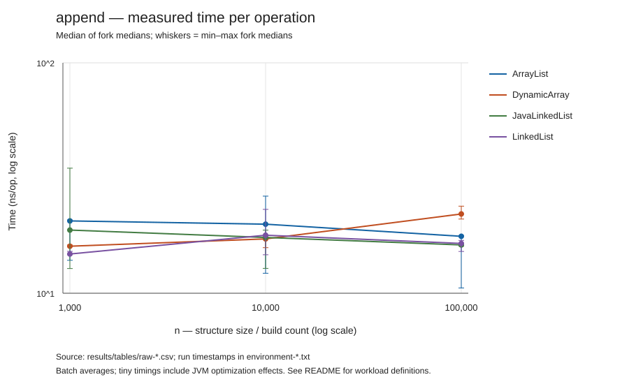
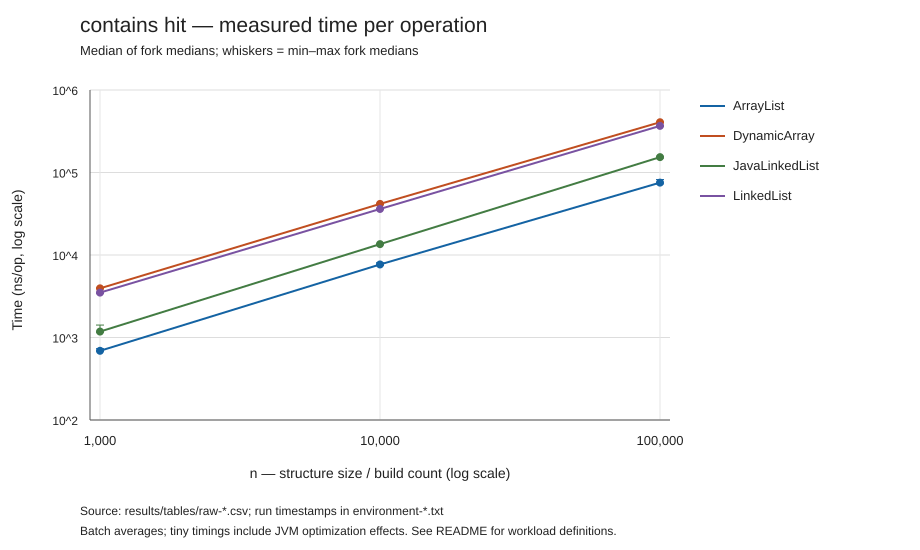
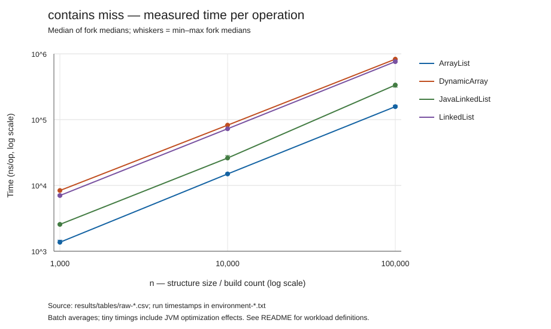
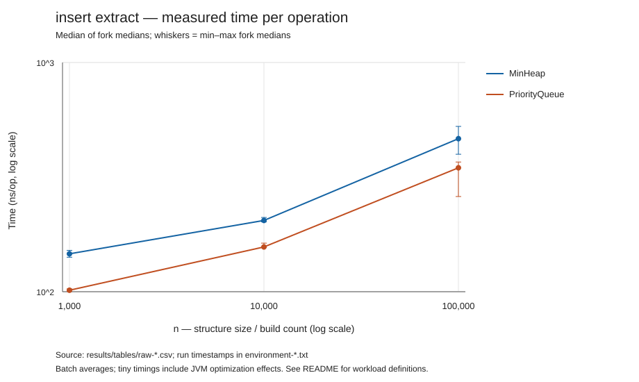
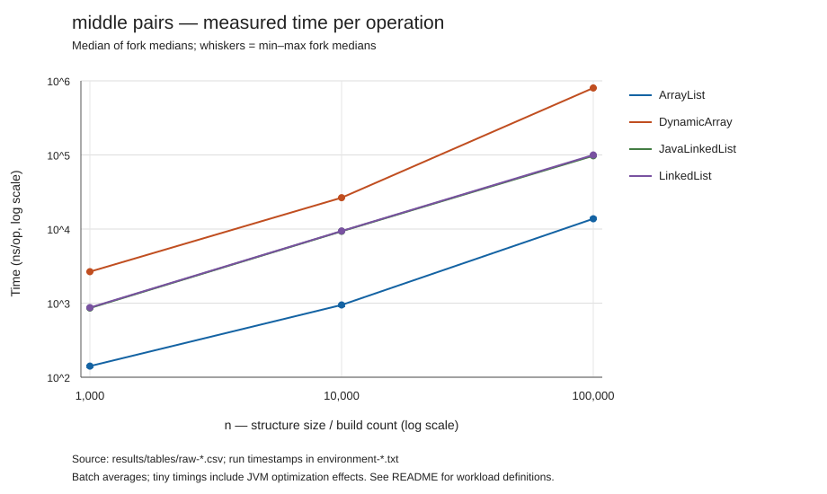
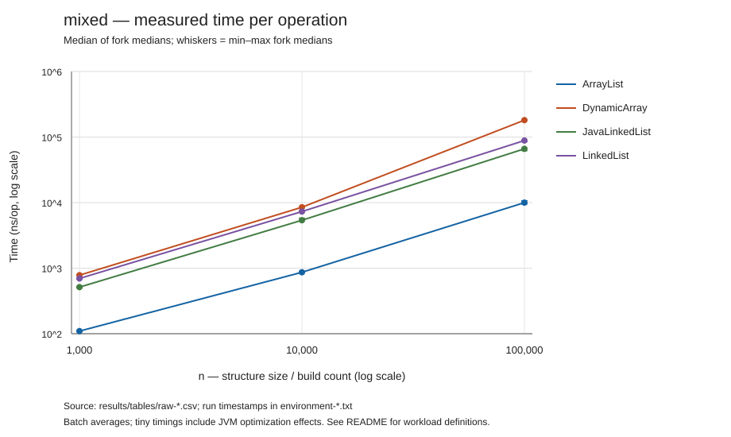
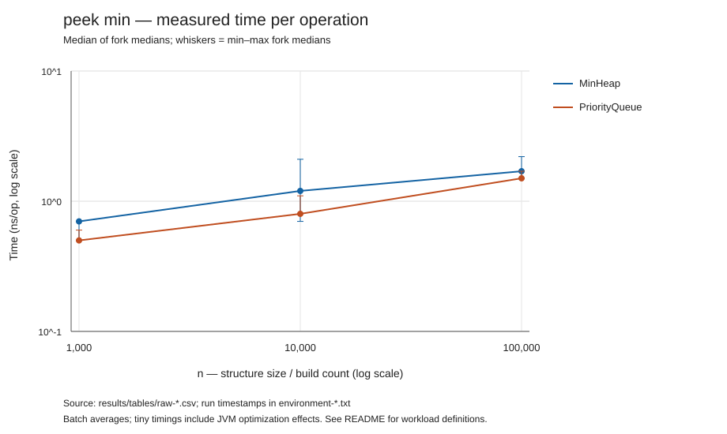
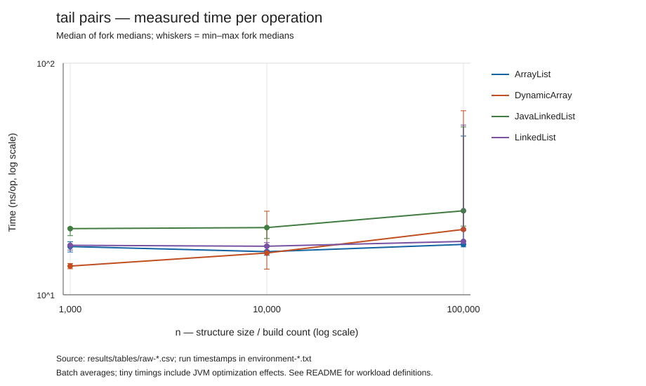

# Measured benchmark results

Each estimate is the median of the per-JVM medians. Ranges span the smallest and largest fork medians; they are not confidence intervals. Units: nanoseconds per API operation (ns/op). Pair workloads divide by both calls. See the root README for setup and limitations.

## append

| Structure | n | Median ns/op | Fork median range | Samples / forks |
|---|---:|---:|---:|---:|
| ArrayList | 1,000 | 20.60 | 13.90–20.80 | 15 / 3 |
| ArrayList | 10,000 | 19.94 | 12.21–26.39 | 15 / 3 |
| ArrayList | 100,000 | 17.66 | 10.54–17.81 | 15 / 3 |
| DynamicArray | 1,000 | 16.00 | 15.90–16.20 | 15 / 3 |
| DynamicArray | 10,000 | 17.21 | 15.77–17.58 | 15 / 3 |
| DynamicArray | 100,000 | 22.09 | 20.99–23.87 | 15 / 3 |
| JavaLinkedList | 1,000 | 18.80 | 12.80–34.90 | 15 / 3 |
| JavaLinkedList | 10,000 | 17.46 | 12.82–18.79 | 15 / 3 |
| JavaLinkedList | 100,000 | 16.20 | 16.00–16.50 | 15 / 3 |
| LinkedList | 1,000 | 14.80 | 14.70–15.20 | 15 / 3 |
| LinkedList | 10,000 | 17.86 | 14.69–23.12 | 15 / 3 |
| LinkedList | 100,000 | 16.45 | 15.18–16.96 | 15 / 3 |

## build_drain

| Structure | n | Median ns/op | Fork median range | Samples / forks |
|---|---:|---:|---:|---:|
| MinHeap | 1,000 | 137.35 | 136.85–137.85 | 15 / 3 |
| MinHeap | 10,000 | 203.64 | 202.07–206.34 | 15 / 3 |
| MinHeap | 100,000 | 394.79 | 392.40–404.73 | 15 / 3 |
| PriorityQueue | 1,000 | 109.45 | 104.35–115.05 | 15 / 3 |
| PriorityQueue | 10,000 | 160.92 | 152.71–164.62 | 15 / 3 |
| PriorityQueue | 100,000 | 269.39 | 256.89–272.79 | 15 / 3 |

## contains_hit

| Structure | n | Median ns/op | Fork median range | Samples / forks |
|---|---:|---:|---:|---:|
| ArrayList | 1,000 | 689.90 | 684.30–732.20 | 15 / 3 |
| ArrayList | 10,000 | 7676.90 | 7483.50–8047.50 | 15 / 3 |
| ArrayList | 100,000 | 75386.90 | 72866.80–82099.60 | 15 / 3 |
| DynamicArray | 1,000 | 3944.00 | 3942.30–3965.90 | 15 / 3 |
| DynamicArray | 10,000 | 41634.40 | 41280.30–41918.50 | 15 / 3 |
| DynamicArray | 100,000 | 406773.90 | 406538.00–407396.80 | 15 / 3 |
| JavaLinkedList | 1,000 | 1179.90 | 1158.30–1415.10 | 15 / 3 |
| JavaLinkedList | 10,000 | 13540.90 | 13376.40–13622.80 | 15 / 3 |
| JavaLinkedList | 100,000 | 153552.50 | 149843.30–157228.50 | 15 / 3 |
| LinkedList | 1,000 | 3501.10 | 3407.90–3529.50 | 15 / 3 |
| LinkedList | 10,000 | 36136.90 | 35751.10–36518.10 | 15 / 3 |
| LinkedList | 100,000 | 367362.80 | 361603.90–370416.60 | 15 / 3 |

## contains_miss

| Structure | n | Median ns/op | Fork median range | Samples / forks |
|---|---:|---:|---:|---:|
| ArrayList | 1,000 | 1369.50 | 1351.70–1475.60 | 15 / 3 |
| ArrayList | 10,000 | 14951.90 | 14606.50–15473.50 | 15 / 3 |
| ArrayList | 100,000 | 157595.80 | 153896.50–165112.10 | 15 / 3 |
| DynamicArray | 1,000 | 8372.90 | 8355.70–8402.30 | 15 / 3 |
| DynamicArray | 10,000 | 82449.10 | 82352.80–83164.60 | 15 / 3 |
| DynamicArray | 100,000 | 830193.50 | 827273.60–831994.00 | 15 / 3 |
| JavaLinkedList | 1,000 | 2557.80 | 2528.50–2612.80 | 15 / 3 |
| JavaLinkedList | 10,000 | 26106.60 | 25915.50–28508.20 | 15 / 3 |
| JavaLinkedList | 100,000 | 335541.90 | 310841.00–337112.20 | 15 / 3 |
| LinkedList | 1,000 | 7025.50 | 6869.90–7263.10 | 15 / 3 |
| LinkedList | 10,000 | 72707.70 | 71676.30–73037.20 | 15 / 3 |
| LinkedList | 100,000 | 761119.00 | 749608.60–803736.90 | 15 / 3 |

## front_pairs

| Structure | n | Median ns/op | Fork median range | Samples / forks |
|---|---:|---:|---:|---:|
| ArrayList | 1,000 | 236.00 | 217.20–248.15 | 15 / 3 |
| ArrayList | 10,000 | 2141.45 | 2134.75–2310.00 | 15 / 3 |
| ArrayList | 100,000 | 29037.55 | 28958.65–29443.20 | 15 / 3 |
| DynamicArray | 1,000 | 5278.00 | 5197.35–5351.05 | 15 / 3 |
| DynamicArray | 10,000 | 53326.75 | 53176.95–53467.35 | 15 / 3 |
| DynamicArray | 100,000 | 1609867.55 | 1596234.35–1610236.40 | 15 / 3 |
| JavaLinkedList | 1,000 | 19.20 | 18.80–21.10 | 15 / 3 |
| JavaLinkedList | 10,000 | 20.20 | 18.50–27.50 | 15 / 3 |
| JavaLinkedList | 100,000 | 22.60 | 20.65–73.45 | 15 / 3 |
| LinkedList | 1,000 | 17.95 | 16.40–18.80 | 15 / 3 |
| LinkedList | 10,000 | 18.85 | 18.10–19.70 | 15 / 3 |
| LinkedList | 100,000 | 20.05 | 17.80–56.80 | 15 / 3 |

## insert_extract

| Structure | n | Median ns/op | Fork median range | Samples / forks |
|---|---:|---:|---:|---:|
| MinHeap | 1,000 | 146.35 | 141.40–151.50 | 15 / 3 |
| MinHeap | 10,000 | 204.65 | 201.60–210.85 | 15 / 3 |
| MinHeap | 100,000 | 465.30 | 397.85–526.30 | 15 / 3 |
| PriorityQueue | 1,000 | 101.50 | 100.60–102.90 | 15 / 3 |
| PriorityQueue | 10,000 | 156.80 | 155.85–162.90 | 15 / 3 |
| PriorityQueue | 100,000 | 347.25 | 260.20–368.00 | 15 / 3 |

## middle_pairs

| Structure | n | Median ns/op | Fork median range | Samples / forks |
|---|---:|---:|---:|---:|
| ArrayList | 1,000 | 141.35 | 135.25–145.45 | 15 / 3 |
| ArrayList | 10,000 | 945.10 | 896.25–958.55 | 15 / 3 |
| ArrayList | 100,000 | 13758.20 | 13475.35–14386.25 | 15 / 3 |
| DynamicArray | 1,000 | 2658.55 | 2635.45–2675.65 | 15 / 3 |
| DynamicArray | 10,000 | 26487.40 | 26453.45–26811.45 | 15 / 3 |
| DynamicArray | 100,000 | 801216.90 | 799610.00–803096.20 | 15 / 3 |
| JavaLinkedList | 1,000 | 858.80 | 851.60–877.25 | 15 / 3 |
| JavaLinkedList | 10,000 | 9323.25 | 9220.30–9474.80 | 15 / 3 |
| JavaLinkedList | 100,000 | 97440.25 | 97054.75–100806.80 | 15 / 3 |
| LinkedList | 1,000 | 871.10 | 866.40–877.75 | 15 / 3 |
| LinkedList | 10,000 | 9403.60 | 9170.85–9455.20 | 15 / 3 |
| LinkedList | 100,000 | 99873.75 | 94856.25–100050.60 | 15 / 3 |

## mixed

| Structure | n | Median ns/op | Fork median range | Samples / forks |
|---|---:|---:|---:|---:|
| ArrayList | 1,000 | 109.64 | 106.91–112.09 | 15 / 3 |
| ArrayList | 10,000 | 865.82 | 841.36–902.45 | 15 / 3 |
| ArrayList | 100,000 | 9992.45 | 9472.00–10713.27 | 15 / 3 |
| DynamicArray | 1,000 | 781.45 | 780.91–798.55 | 15 / 3 |
| DynamicArray | 10,000 | 8505.27 | 8475.64–8575.73 | 15 / 3 |
| DynamicArray | 100,000 | 181194.55 | 180308.91–184061.36 | 15 / 3 |
| JavaLinkedList | 1,000 | 513.45 | 503.18–532.18 | 15 / 3 |
| JavaLinkedList | 10,000 | 5386.27 | 5292.36–5827.73 | 15 / 3 |
| JavaLinkedList | 100,000 | 66182.64 | 61612.55–67995.91 | 15 / 3 |
| LinkedList | 1,000 | 696.55 | 676.73–700.91 | 15 / 3 |
| LinkedList | 10,000 | 7308.36 | 7168.91–7603.00 | 15 / 3 |
| LinkedList | 100,000 | 88559.55 | 84447.09–89979.27 | 15 / 3 |

## peek_min

| Structure | n | Median ns/op | Fork median range | Samples / forks |
|---|---:|---:|---:|---:|
| MinHeap | 1,000 | 0.70 | 0.50–0.70 | 15 / 3 |
| MinHeap | 10,000 | 1.20 | 0.70–2.10 | 15 / 3 |
| MinHeap | 100,000 | 1.70 | 1.50–2.20 | 15 / 3 |
| PriorityQueue | 1,000 | 0.50 | 0.50–0.60 | 15 / 3 |
| PriorityQueue | 10,000 | 0.80 | 0.80–1.10 | 15 / 3 |
| PriorityQueue | 100,000 | 1.50 | 1.50–1.70 | 15 / 3 |

## random_get

| Structure | n | Median ns/op | Fork median range | Samples / forks |
|---|---:|---:|---:|---:|
| ArrayList | 1,000 | 12.10 | 12.00–12.20 | 15 / 3 |
| ArrayList | 10,000 | 14.90 | 14.60–15.40 | 15 / 3 |
| ArrayList | 100,000 | 40.90 | 26.20–55.20 | 15 / 3 |
| DynamicArray | 1,000 | 13.40 | 13.40–15.40 | 15 / 3 |
| DynamicArray | 10,000 | 36.30 | 18.30–40.90 | 15 / 3 |
| DynamicArray | 100,000 | 67.50 | 64.20–96.60 | 15 / 3 |
| JavaLinkedList | 1,000 | 420.20 | 420.10–435.90 | 15 / 3 |
| JavaLinkedList | 10,000 | 4501.00 | 4492.30–4687.30 | 15 / 3 |
| JavaLinkedList | 100,000 | 52345.10 | 48433.50–52518.20 | 15 / 3 |
| LinkedList | 1,000 | 427.00 | 422.80–429.40 | 15 / 3 |
| LinkedList | 10,000 | 4584.20 | 4484.20–5067.80 | 15 / 3 |
| LinkedList | 100,000 | 49300.00 | 49263.80–51185.80 | 15 / 3 |

## tail_pairs

| Structure | n | Median ns/op | Fork median range | Samples / forks |
|---|---:|---:|---:|---:|
| ArrayList | 1,000 | 16.15 | 15.30–16.95 | 15 / 3 |
| ArrayList | 10,000 | 15.35 | 14.80–16.35 | 15 / 3 |
| ArrayList | 100,000 | 16.50 | 16.10–48.45 | 15 / 3 |
| DynamicArray | 1,000 | 13.30 | 12.95–13.65 | 15 / 3 |
| DynamicArray | 10,000 | 15.15 | 12.90–22.95 | 15 / 3 |
| DynamicArray | 100,000 | 19.15 | 18.95–62.30 | 15 / 3 |
| JavaLinkedList | 1,000 | 19.30 | 18.00–19.50 | 15 / 3 |
| JavaLinkedList | 10,000 | 19.50 | 17.50–19.55 | 15 / 3 |
| JavaLinkedList | 100,000 | 23.05 | 19.80–53.05 | 15 / 3 |
| LinkedList | 1,000 | 16.35 | 15.60–16.45 | 15 / 3 |
| LinkedList | 10,000 | 16.20 | 15.55–16.80 | 15 / 3 |
| LinkedList | 100,000 | 17.00 | 17.00–54.05 | 15 / 3 |

